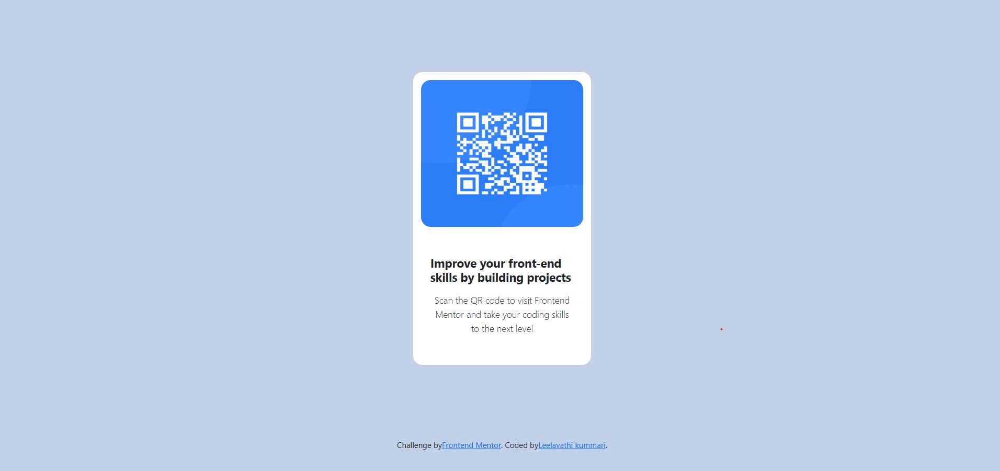

# Frontend Mentor - QR code component solution

This is a solution to the [QR code component challenge on Frontend Mentor](https://www.frontendmentor.io/challenges/qr-code-component-iux_sIO_H). Frontend Mentor challenges help you improve your coding skills by building realistic projects.

## Table of contents

- [Overview](#overview)
  - [Screenshot](#screenshot)
  - [Links](#links)
- [My process](#my-process)
  - [Built with](#built-with)
  - [What I learned](#what-i-learned)
  - [Useful resources](#useful-resources)
- [Author](#author)
- [Acknowledgments](#acknowledgments)

## Overview

In this challenge i have made a qr-code-component by using flex box and bootstrap classes. It represent how we can buid card component by using bootstrap card classes.

### Screenshot

### Links

- Solution URL: (https://github.com/lillyleela/qr-code-component)
- Live Site URL: (https://lillyleela.github.io/qr-code-component/)

## My process

-I started with taking starter file
-I used bootstarp classes for flex and content-center
-I used semantic tags for images and html structure
-I used some of the css styles for bg and other classes

### Built with

- Semantic HTML5 markup
- CSS custom properties
- Flexbox
- CSS Grid
- Mobile-first workflow

### What I learned

Use this section to recap over some of your major learnings while working through this project. Writing these out and providing code samples of areas you want to highlight is a great way to reinforce your own knowledge.

### Useful Resources

-- [MDN Web Docs](https://developer.mozilla.org/es/) - Reading the documentation for CSS properties behavior

## Author

- Leela
- Frontend Mentor - [@Leela](https://www.frontendmentor.io/profile/lillyleela)
